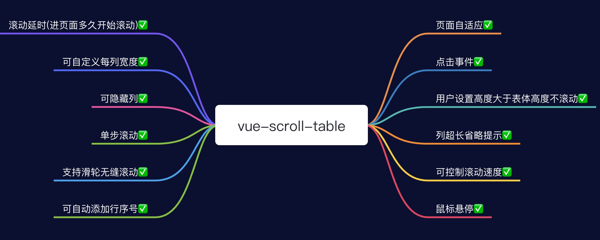
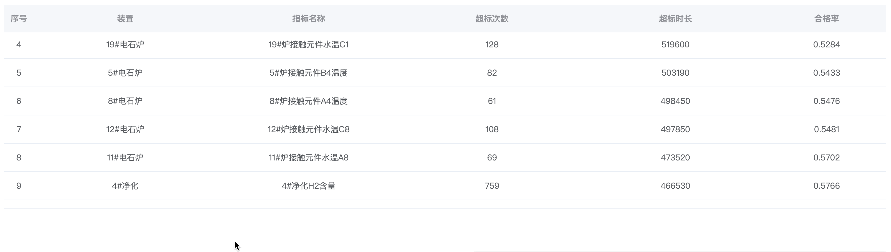

# 指南
## 功能预览


## 安装
```
npm install vue-table-scroll
```
## 使用
### 注册组件
<i style="color:red;font-size:18px;">⚠️</i>
<i style="color:#4569d4;">注意:该组件依赖element-ui样式,如果使用的项目中使用了element-ui,无需再引入样式文件。即:</i>`vue-table-scroll/dist/style.css`
```js
// main.js
// 1.全局引入
import TableScroll from 'vue-table-scroll'
import 'vue-table-scroll/dist/style.css'

Vue.use(TableScroll)

// 自定义名称 默认组件名称为 TableScroll
Vue.use(TableScroll, { componentName: 'table' })

// 2.组件内引入
<script>
import TableScroll from 'vue-table-scroll'
import 'vue-table-scroll/dist/style.css'
export default {
  components: {
    TableScroll
  }
}
</script>
```

### 使用组件
```vue
<template>
  <div>
    <table-scroll
      :table-header="tableHeader"
      :table-data="tableData"
    />
  </div>
</template>

<script>
import TableScroll from '@/components/table/index.js'
import 'vue-table-scroll/dist/style.css'

export default {
  components: {
    TableScroll
  },
  data() {
    return {
      tableHeader: [
        {label: '日期', prop: "date"},
        {label: '姓名', prop: "name"},
        {label: '地址', prop: "address"}
      ],
      tableData:[{
        date: '2016-05-02',
        name: '王小虎',
        address: '上海市普陀区金沙江路 1518 弄'
      }, {
        date: '2016-05-04',
        name: '王小虎',
        address: '上海市普陀区金沙江路 1517 弄'
      }, {
        date: '2016-05-01',
        name: '王小虎',
        address: '上海市普陀区金沙江路 1519 弄'
      }]
    }
  }
}
</script>

<style></style>

```
